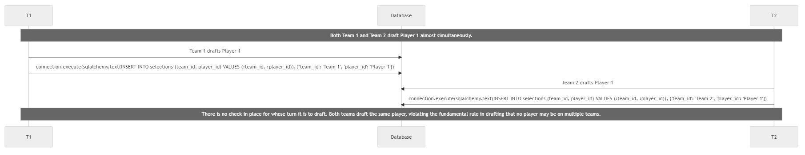
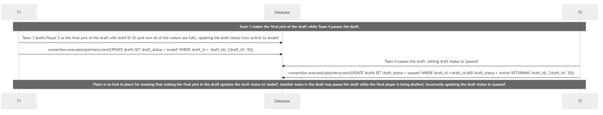
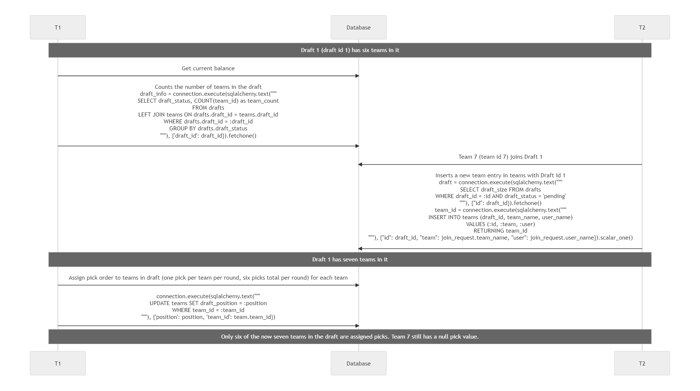

### 1. Draft Order Enforcement:

**Mechanism**: The draft player endpoint ensures that teams draft players according to a predetermined order. This order is respected by verifying the team's turn based on the ‘draft_position’ and the number of selections already made.
Concurrency Control: This mechanism prevents concurrent drafts where two teams might try to draft simultaneously, thereby ensuring that draft selections occur in a sequential and orderly manner.

**Dirty Read**

**Scenario**:
Team 1 is drafting a player, but the changes have not been committed yet. Team 2 drafts the same player while the transaction of Team 1 is still in progress, leading to both teams drafting the same player.

**Sequence Diagram**:

### 2. Ensuring a Draft Ends:

**Mechanism**: The draft player endpoint ensures that the final pick in the draft will update ‘draft_status’ to ‘ended’. By using a FOR UPDATE to lock the rows until the transaction is complete, no other updates to the draft status may be made. 

**Concurrency Control**: This check avoids the scenario where a team pauses the draft while the last pick of the draft is being made, thus ensuring that a fully completed draft ends as expected.

**Dirty Read**

**Scenario**:
Team 3 is drafting a player, and this is the final pick of the draft. Therefore, after this player pick is confirmed to be valid, the draft status will be updated to ‘ended’. Team 4 pauses the draft while the transaction of Team 3 is still in progress, leading to the draft being in a paused state (capable of being resumed to active) while there are no more picks to be made.

**Sequence Diagram**:

### 3. Preventing Teams with Null Draft Positions:

**Mechanism**: Using FOR UPDATE syntax in SQL queries when joining drafts and starting drafts, teams are prevented from joining drafts while the draft is in the process of being started. For example, if a call was made to start a draft immediately before a call to join the draft, the join transaction would wait for the start transaction to finish since they are both attempting to update the same row. Thus, the phenomenon is prevented.

**Concurrency control**: This mechanism prevents a potential scenario where a team successfully joins a draft but does not get a draft position assigned. Since draft positions are assigned when a draft is being started, this scenario could occur if there were no concurrency control mechanisms in place.

**Lost Update**

**Scenario**:
One of the members of the draft is attempting to start the draft, a process that involves assigning the draft order at random to all members that are currently in the draft. However, at the same time the draft is being started, Team X attempts to join the draft. Since the draft status has not yet been changed, Team X is able to join. Even though the status has not yet been updated, the start draft process has already begun assigning draft positions to all teams that were signed up when the process began. As a result, the draft begins with Team X not having a draft position.

**Sequence Diagram**:

